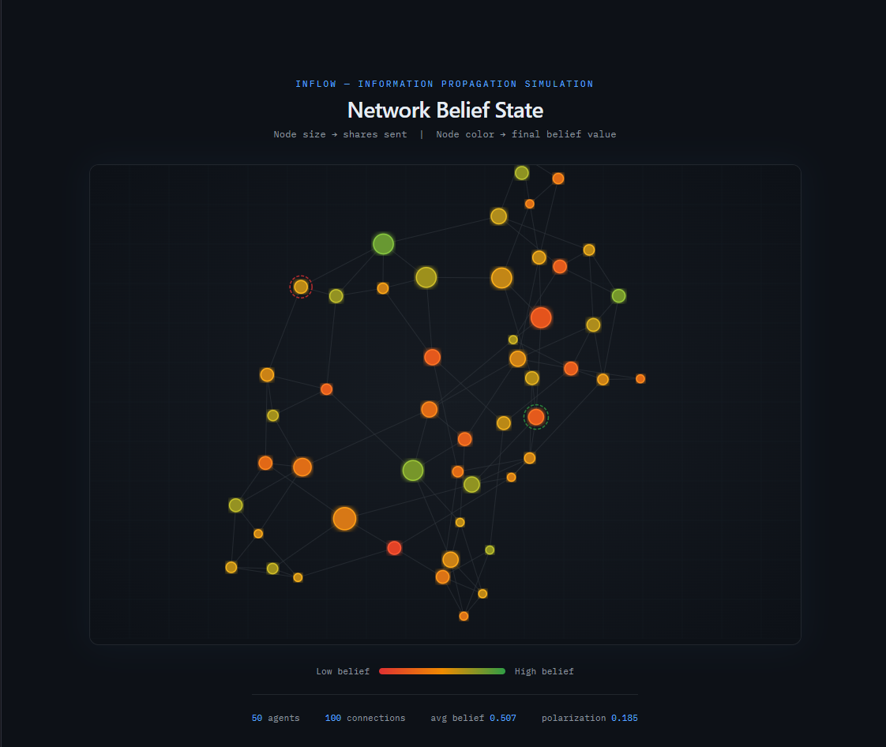
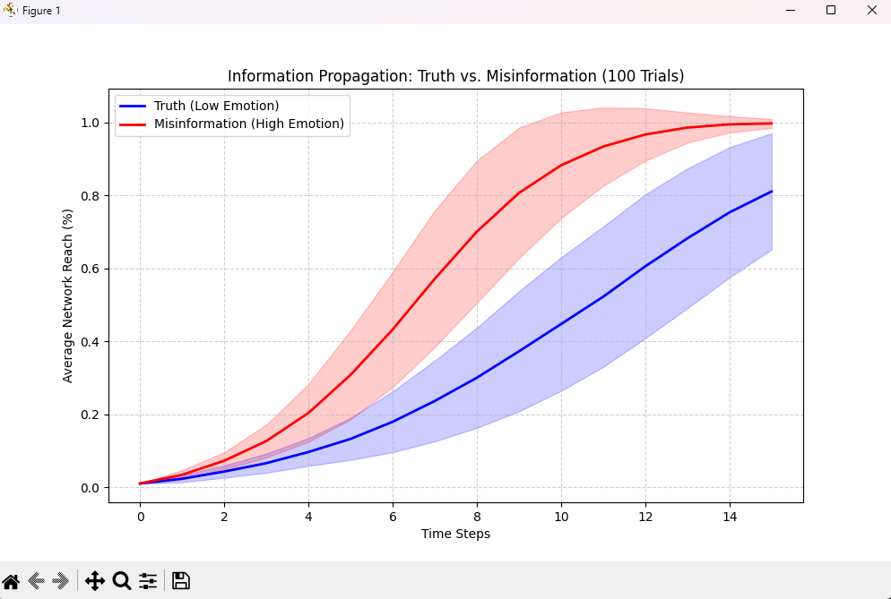
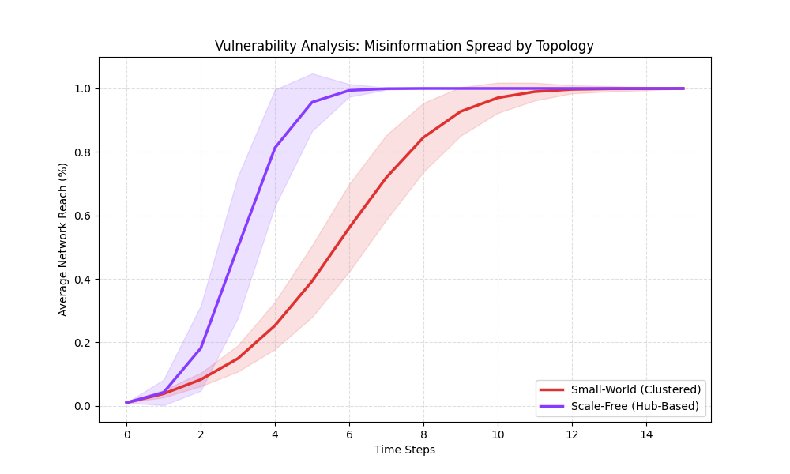
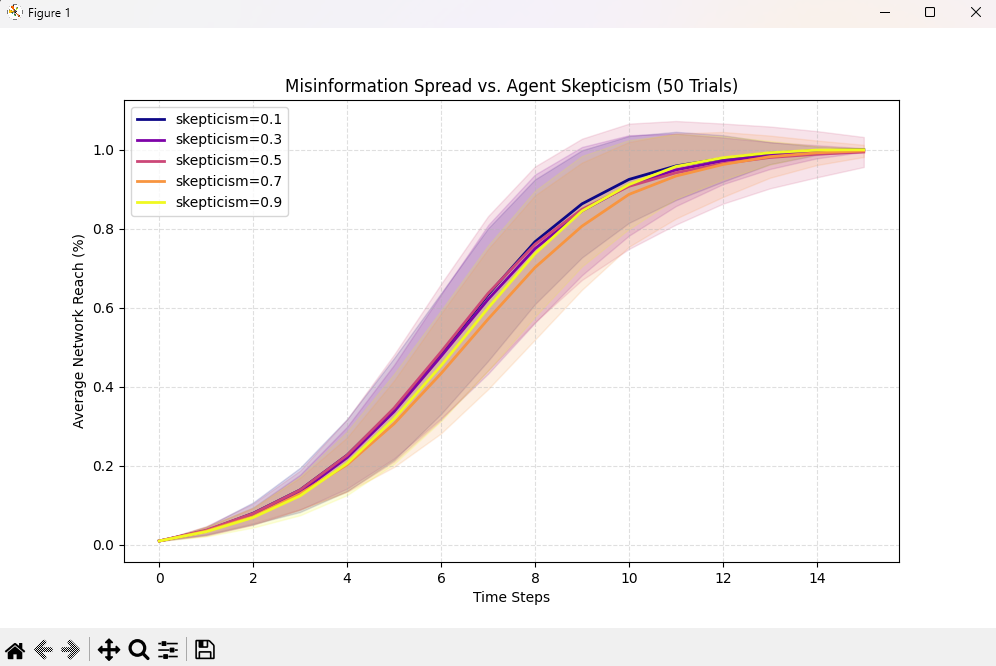

# INFLOW

An agent-based simulation of how information and misinformation spread through social networks. Each agent in the network has psychological traits (belief, bias, skepticism, trust) that determine how they receive and share information. The simulation models competing content - factual vs. emotional misinformation - propagating simultaneously across different network topologies.

Built for CSCI 412: Senior Seminar II.

**Live Demo:** http://seminar2.duckdns.org

---

## Screenshots

| Network Visualization | Propagation Analysis |
|---|---|
|  |  |

| Topology Comparison | Parameter Sensitivity |
|---|---|
|  |  |

---

## Setup

**Requirements:** Python 3.10+, Node.js 18+

Install Python dependencies:

```bash
pip install -r requirements.txt
```

---

## Running the Simulation

Run a basic simulation with default settings (50 agents, small-world network, 15 steps):

```bash
python main.py
```

Available options:

```bash
python main.py --agents 100 --steps 20 --topology scale_free --seed 42
```

| Flag | Default | Description |
|---|---|---|
| `--agents` | 50 | Number of agents in the network |
| `--steps` | 15 | Number of simulation time steps |
| `--topology` | `small_world` | Network type: `random`, `small_world`, `scale_free` |
| `--seed` | 42 | Random seed for reproducibility |
| `--share-prob` | 1.0 | Global sharing probability multiplier |
| `--output-dir` | `output/` | Where to write CSV output files |
| `--reset` | false | Clear output directory before running |

After running, CSV results are written to `output/`:

- `spread_log.csv` - per-step spread fraction and belief stats for each info item
- `agent_states.csv` - final belief, bias, skepticism, and share count for each agent
- `info_items.csv` - final state of each injected information item
- `edges.csv` - edge list for the generated network

---

## Running Experiments

### Monte Carlo: Truth vs. Misinformation

Runs 100 trials comparing a high-truth/low-emotion item against a low-truth/high-emotion item on a small-world network. Produces a propagation plot and summary CSV.

```bash
python experiment_runner.py
```

Output: `propagation_analysis.png`, `experiment_summary.csv`

### Topology Comparison

Compares misinformation spread across small-world and scale-free networks over 100 trials.

```bash
python topology_comparison.py
```

Output: `topology_comparison_results.png`

### Parameter Sensitivity

Sweeps agent skepticism and trust radius from 0.1 to 0.9, measuring how each affects spread speed and final reach.

```bash
python parameter_analysis.py
```

Output: `skepticism_sweep.png`, `trust_radius_sweep.png`, `parameter_sweep_summary.csv`

### Hub vs. Random Injection

Compares starting misinformation from the highest-degree node (hub) vs. a random node, across both small-world and scale-free topologies.

```bash
python hub_injection.py
```

Output: `hub_injection_results.png`, `hub_injection_summary.csv`

---

## Visualization

The visualization is a React + D3 app that renders the network graph from the simulation output. It reads the CSV files generated by `main.py`.

Start the dev server:

```bash
cd visualization
npm install
npm run dev
```

Then open `http://localhost:5173` in your browser. Run `python main.py` first so the CSVs exist in `output/` - they are automatically copied to `visualization/public/` when the simulation saves outputs.

Features:
- Force-directed network graph with belief-colored nodes (red = low belief, green = high belief)
- Node size scales with how many times the agent shared information
- Origin nodes are highlighted with a dashed ring (green = truth origin, red = misinformation origin)
- Hover any node to inspect its belief, bias, skepticism, trust radius, and share count
- Drag nodes to rearrange the layout

---

## Project Structure

```
simulation/
  agent.py          Agent model with belief update logic
  engine.py         Simulation engine (propagation, logging, CSV output)
  information.py    InfoItem representation
  network.py        Network generation (random, small-world, scale-free)

visualization/      React + D3 + TypeScript frontend (Vite)
output/             CSV files generated by simulation runs
assets/screenshots/ Screenshots used in reports
docs/               Report PDFs

main.py                   CLI entry point
experiment_runner.py      Truth vs. misinformation Monte Carlo
topology_comparison.py    Small-world vs. scale-free comparison
parameter_analysis.py     Agent parameter sensitivity sweeps
hub_injection.py          Hub vs. random origin injection analysis
```

---

## AI Tool Acknowledgment

AI tools were used as a collaborative aid during development for implementation assistance, debugging, and report formatting. All simulation design decisions, experimental setups, and analytical interpretations were made and reviewed by the author.
